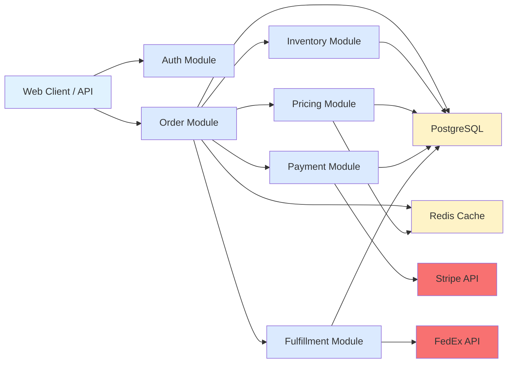
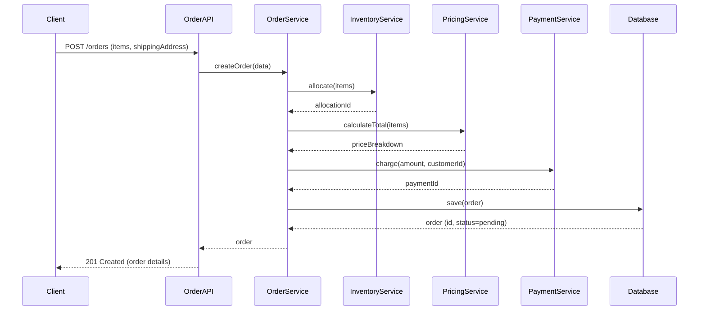
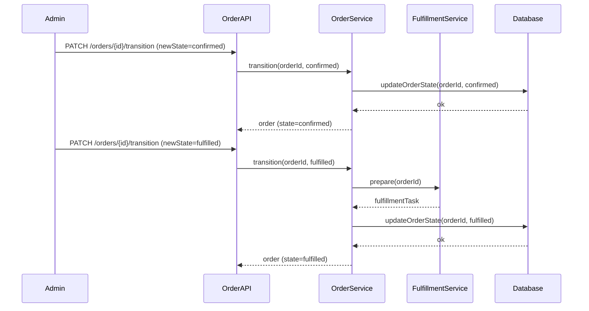
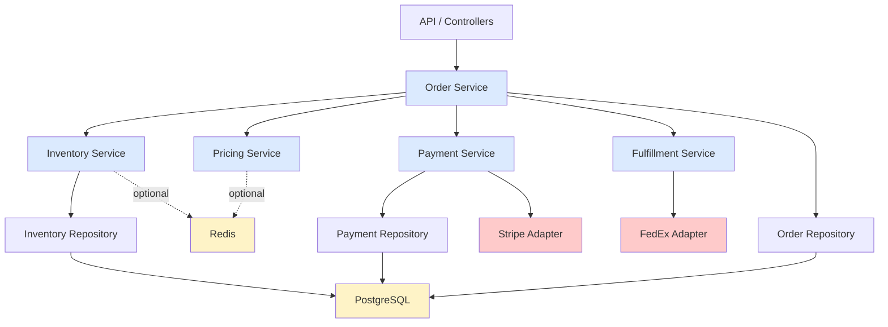

# Example Architecture Overview Report

This is a complete example of what an architecture overview report should look like.

---

# Architecture Overview — E-Commerce Order System

**Date:** May 28, 2026  
**Report:** /tmp/architecture-overview-2026-05-28T053046Z.md

---

## Executive Summary

This is a Node.js-based e-commerce platform managing the complete order lifecycle from customer intake through fulfillment. The system uses a layered architecture with clear separation between API, domain logic, and persistence layers. Orders flow through a state machine (pending → confirmed → fulfilled → delivered), with pricing calculated dynamically and inventory allocated in real-time.

---

## System Diagram

---

## Module Breakdown

### Order Module

**Purpose:** Manages the complete order lifecycle from customer intake through delivery, including order creation, state transitions, and order history.

**Key files:**
- `src/modules/order/handler.ts` — HTTP endpoint handlers
- `src/modules/order/service.ts` — business logic and state machine
- `src/modules/order/repository.ts` — database persistence
- `src/models/Order.ts` — domain model and types

**Responsibilities:**
- Order creation and validation
- Order state transitions (pending → confirmed → fulfilled → delivered)
- Order persistence and retrieval
- Order history tracking

**Dependencies:**
- Inventory Module (allocate stock)
- Pricing Module (calculate totals)
- Payment Module (charge customer)
- Fulfillment Module (prepare shipment)
- PostgreSQL database (Prisma ORM)

**Key interfaces:**
- `create(data: CreateOrderRequest): Order` — validates items, calculates pricing, allocates inventory, creates order
- `findById(id: string): Order` — retrieves order with full details
- `transition(id: string, newState: OrderState): void` — validates state transition, saves to DB
- `listByCustomer(customerId: string): Order[]` — retrieves all orders for a customer

---

### Inventory Module

**Purpose:** Manages product stock levels across warehouses and handles real-time allocation to orders.

**Key files:**
- `src/modules/inventory/handler.ts` — HTTP endpoint handlers
- `src/modules/inventory/service.ts` — allocation logic and stock management
- `src/modules/inventory/repository.ts` — database access
- `src/models/Inventory.ts` — domain model

**Responsibilities:**
- Stock level tracking per warehouse
- Inventory allocation to orders
- Deallocation on order cancellation
- Stock level synchronization

**Dependencies:**
- PostgreSQL database (Prisma ORM)
- Redis cache (stock levels)

**Key interfaces:**
- `allocate(items: LineItem[]): AllocationResult` — reserves stock for an order
- `deallocate(orderId: string): void` — releases allocated stock
- `getAvailable(sku: string): number` — returns available quantity for a SKU

---

### Pricing Module

**Purpose:** Calculates order totals, applies discounts, and manages pricing rules.

**Key files:**
- `src/modules/pricing/service.ts` — pricing calculation logic
- `src/modules/pricing/rules/` — rule definitions
- `src/models/Price.ts` — pricing data structures

**Responsibilities:**
- Line item pricing lookup
- Discount application (coupon codes, bulk discounts)
- Tax calculation
- Price caching

**Dependencies:**
- PostgreSQL (pricing rules, product base prices)
- Redis (price cache)

**Key interfaces:**
- `calculateOrderTotal(items: LineItem[], customerId?: string): PriceBreakdown` — returns itemized pricing
- `applyDiscount(items: LineItem[], couponCode: string): PriceBreakdown` — applies coupon, returns adjusted total

---

### Payment Module

**Purpose:** Handles payment processing via Stripe, including charge authorization and reconciliation.

**Key files:**
- `src/modules/payment/handler.ts` — HTTP handlers
- `src/modules/payment/service.ts` — Stripe integration
- `src/modules/payment/adapters/stripe-adapter.ts` — adapter pattern for payment provider

**Responsibilities:**
- Authorize customer payment via Stripe
- Handle payment failures and retries
- Maintain payment records
- Reconciliation with Stripe

**Dependencies:**
- Stripe API (external)
- PostgreSQL (payment records)

**Key interfaces:**
- `charge(customerId: string, amount: number, currency: string): PaymentResult` — authorizes charge, returns payment ID
- `getStatus(paymentId: string): PaymentStatus` — retrieves payment status

---

### Fulfillment Module

**Purpose:** Manages order preparation, packing, and shipping.

**Key files:**
- `src/modules/fulfillment/handler.ts` — HTTP handlers
- `src/modules/fulfillment/service.ts` — fulfillment workflow
- `src/modules/fulfillment/adapters/fedex-adapter.ts` — shipping provider integration

**Responsibilities:**
- Create pick/pack tasks
- Generate shipping labels
- Track shipment status
- Handle delivery confirmations

**Dependencies:**
- FedEx API (external shipping)
- PostgreSQL (fulfillment records)

**Key interfaces:**
- `prepare(orderId: string): FulfillmentTask` — creates pick/pack task
- `ship(taskId: string): ShipmentLabel` — generates shipping label
- `trackShipment(orderId: string): TrackingInfo` — returns current shipment status

---

## Data Flow

### Creating an Order

**Scenario:** Customer submits order with items and address.

### Transitioning Order to Fulfilled

**Scenario:** Order is ready to ship; transition from pending → confirmed → fulfilled.

---

## Dependency Graph

---

## Technology Stack

| Component | Technology |
|-----------|-----------|
| Runtime | Node.js 20 LTS |
| Language | TypeScript 5.2 |
| Framework | Express 4.18 |
| Database | PostgreSQL 15 |
| ORM | Prisma 5 |
| Cache | Redis 7 |
| Testing | Jest 29 |
| API Documentation | Swagger/OpenAPI |
| Package Manager | npm 10 |

---

## Architectural Patterns

**Layered Architecture** — Clear separation between API layer (controllers/handlers), service layer (business logic), and data layer (repositories). Each layer has a single responsibility; changes in one layer don't force changes in others.

**Repository Pattern** — Data access is abstracted behind Repository interfaces. Services never query the database directly; they go through repositories. This enables easy switching between database implementations and simplified testing.

**Adapter Pattern** — External integrations (Stripe, FedEx) are accessed through Adapter interfaces. Production and test environments can use different adapters without changing service code. The "two adapters = real seam" principle applies here.

**State Machine** — Orders move through well-defined states (pending → confirmed → fulfilled → delivered) with explicit transition rules. Invalid transitions are rejected; state transitions are atomic.

**Dependency Injection** — Services receive dependencies via constructor, enabling loose coupling and testability. No global state or singletons.

---

## Terminology & Glossary

- **Order** — a customer's request for goods. Orders progress through states: pending (created, awaiting payment) → confirmed (payment received, awaiting fulfillment) → fulfilled (shipped) → delivered (customer received).
  - Implementation: `src/models/Order.ts`

- **Allocation** — process of reserving inventory for an order. When an order is created, inventory is allocated; if the order is cancelled, allocation is released.
  - Implementation: `src/modules/inventory/service.ts`

- **SKU** (Stock Keeping Unit) — unique identifier for a product variant, combining product ID and attributes (size, color, etc.).
  - Implementation: `src/models/Inventory.ts`

- **Fulfillment** — process of picking items from warehouse, packing, and generating shipping label.
  - Implementation: `src/modules/fulfillment/service.ts`

- **Payment** — charge authorized by Stripe. Payment records are maintained separately from orders for audit and reconciliation.
  - Implementation: `src/modules/payment/service.ts`

- **Seam** — boundary between internal code and external systems. The adapter pattern is used at seams: `StripeAdapter` and `FedExAdapter`.

---

## Observations

**Strong separation of concerns** — Each module owns its domain (Orders own order state, Inventory owns stock, Pricing owns calculations). This makes the system easy to understand and modify.

**Well-defined seams** — External integrations (Stripe, FedEx) are abstracted behind adapter interfaces. Two adapters exist (production + mock), justifying the seam.

**Testability** — Dependency injection makes unit testing straightforward. Services can be tested with mock dependencies. Repository pattern isolates data access, enabling in-memory test repositories.

**Potential improvement** — Consider extracting pricing rules into a rules engine if pricing logic grows. Currently, all pricing is in `PricingService`; a dedicated rules engine would improve flexibility.

---

## Next Steps

- Would you like me to explore any specific module in more detail?
- Shall we discuss architectural improvements?
- Do you want to generate CONTEXT.md from this analysis?

