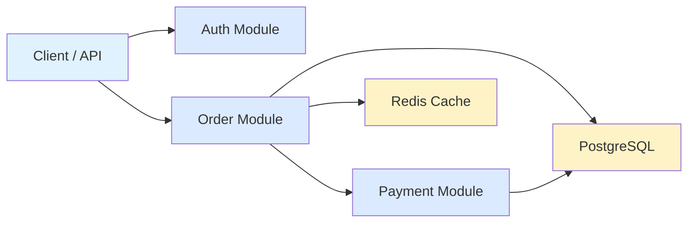
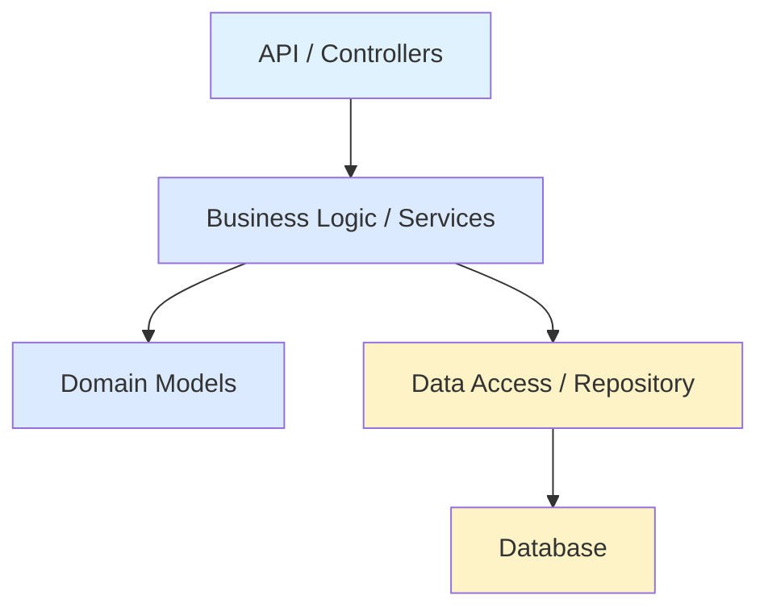
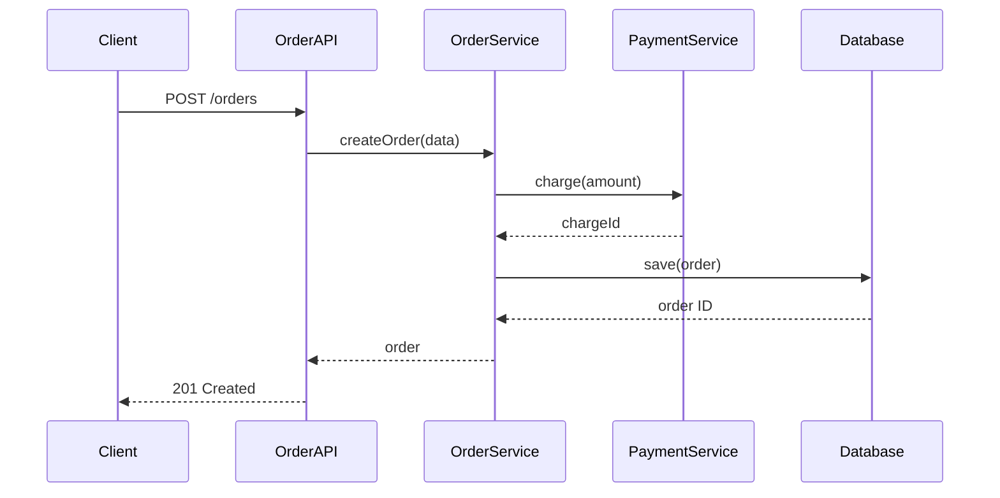
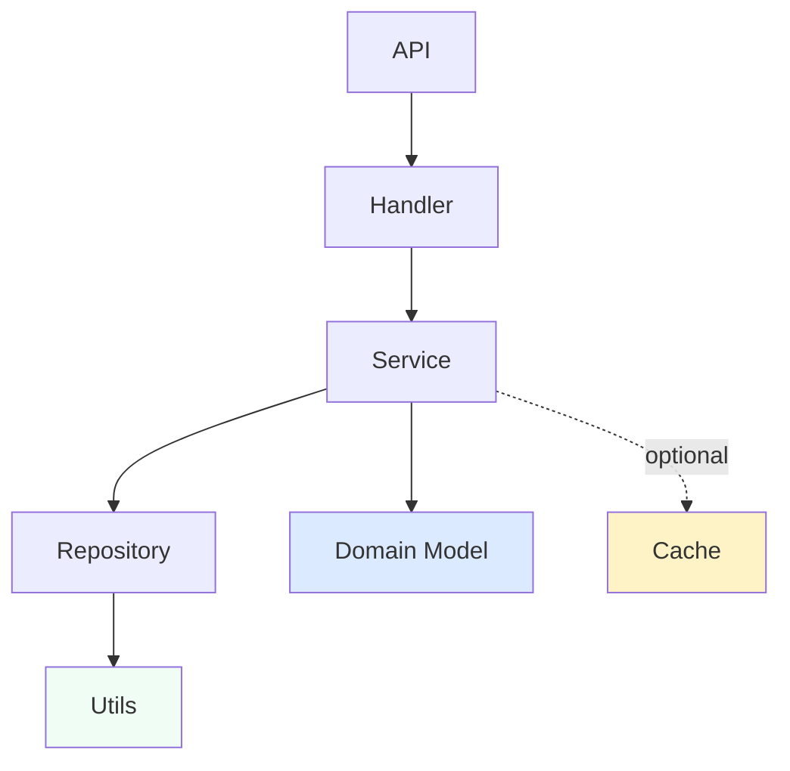
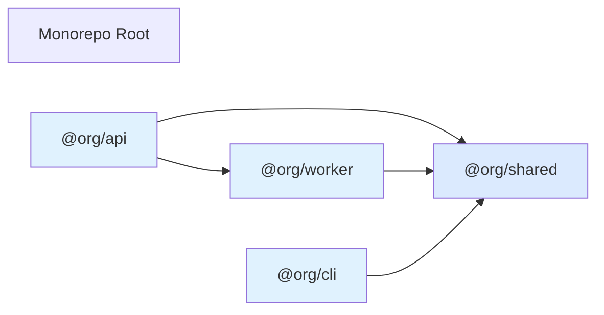

# Report Format Guide

Detailed formatting, diagram patterns, and styling for architecture overview reports.

## File Structure

```
architecture-overview-<ISO-timestamp>.md
```

Example: `architecture-overview-2026-05-28T053046Z.md`

Location: OS temp directory (`$TMPDIR`, `/tmp`, or `%TEMP%`)

## Report Template Structure

```markdown
# Architecture Overview — {{repo name}}

**Date:** {{date}}
**Report:** {{report_path}}

---

## Executive Summary

{{2-3 sentence high-level summary}}

---

## System Diagram

{{Mermaid flowchart or graph showing major subsystems and data flow}}

---

## Module Breakdown

### {{Module Name}}

**Purpose:** {{one sentence}}

**Key files:**
- `path/to/file.ts`
- `path/to/file.ts`

**Responsibilities:**
- {{bullet list}}

**Dependencies:**
- {{other modules or external packages}}

**Key interfaces:**
- `methodName(params)` — {{description}}

### {{Next Module}}
...

---

## Data Flow

### {{Flow Name}}

**Scenario:** {{when this flow occurs}}

{{Sequence diagram}}

### {{Next Flow}}
...

---

## Dependency Graph

{{Graph showing inter-module dependencies}}

---

## Technology Stack

| Component | Technology |
|-----------|-----------|
| Runtime | {{e.g., Node.js 20}} |
| Framework | {{e.g., Express}} |
| Database | {{e.g., PostgreSQL}} |
| ORM | {{e.g., Prisma}} |
| Testing | {{e.g., Jest}} |

---

## Architectural Patterns

- **Layered Architecture** — Clear separation between API, service, and data layers
- {{Other patterns identified}}

---

## Terminology & Glossary

- **{{Term}}** — {{definition, grounded in code}}
- **{{Term}}** — {{definition}}

---

## Observations

{{If applicable: potential friction, circular dependencies, untestable code, naming inconsistencies}}

```

## Diagram Patterns

### System Diagram (Mermaid Flowchart)

Shows top-level modules and their relationships. Use colors to indicate layers or subsystems.



**Color conventions:**
- `#e0f2fe` — Entry points / clients
- `#dbeafe` — Domain / business logic modules
- `#fef3c7` — Infrastructure / persistence
- `#f87171` — External services (red for emphasis)

### Layered Architecture Diagram

Show horizontal layers when the architecture is clearly layered.



### Sequence Diagram

Show interactions between modules during a specific flow.



### Dependency Graph

Show which modules depend on which. Solid lines for direct dependencies, dashed for optional/weak coupling.



### Monorepo Workspace Diagram

For monorepos, show package dependencies:



## File Paths

Use monospaced paths relative to repo root:

```
- `src/modules/order/handler.ts`
- `src/modules/order/service.ts`
- `src/modules/order/repository.ts`
- `src/models/Order.ts`
```

## Glossary Format

Each term should be:
1. **Defined in plain English** — grounded in business logic, not implementation details
2. **Used consistently** — use the same term everywhere in the report
3. **Linked to code** — reference where the term is used in the codebase (optional but helpful)

Example:

```markdown
## Terminology & Glossary

- **Order** — a customer's request for goods. Orders progress through states: pending → confirmed → fulfilled → delivered.
  - Implementation: `src/models/Order.ts`
  
- **Fulfillment** — the process of picking, packing, and shipping an order.
  - Implementation: `src/modules/fulfillment/`

- **SKU** (Stock Keeping Unit) — unique identifier for a product variant, combining product and attributes (size, color, etc.).
  - Implementation: `src/models/SKU.ts`
```

## Module Breakdown Format

For each significant module:

```markdown
### {{Module Name}}

**Purpose:** {{What does this module do? One sentence.}}

**Key files:**
- `src/modules/{{name}}/handler.ts` — HTTP request handling
- `src/modules/{{name}}/service.ts` — business logic
- `src/modules/{{name}}/repository.ts` — database access

**Responsibilities:**
- {{What it owns: state, persistence, validation, etc.}}
- {{Another responsibility}}

**Dependencies:**
- Pricing Module (external pricing lookups)
- Database (PostgreSQL via Prisma)
- External: Stripe API

**Key interfaces:**
- `create(data: CreateOrderInput): Order` — validates and creates a new order
- `findById(id: string): Order` — retrieves an order by ID
- `transition(id: string, newState: OrderState): void` — moves order to new state
```

## Technology Stack Format

Table is cleaner for simple tech stacks:

```markdown
## Technology Stack

| Component | Technology |
|-----------|-----------|
| Runtime | Node.js 20 |
| Framework | Express 4.18 |
| Language | TypeScript 5.2 |
| Database | PostgreSQL 15 |
| ORM | Prisma 5 |
| Testing | Jest 29 |
| Package Manager | pnpm 8 |
```

For complex stacks, use a list:

```markdown
## Technology Stack

**Core:**
- Runtime: Node.js 20
- Language: TypeScript 5.2
- Framework: Express 4.18

**Data:**
- Database: PostgreSQL 15
- ORM: Prisma 5
- Cache: Redis 7

**Development:**
- Testing: Jest 29
- Linting: ESLint 8
- Build: tsc + esbuild
```

## Architectural Patterns Format

List patterns clearly identified in the codebase:

```markdown
## Architectural Patterns

- **Layered Architecture** — Clear separation between API (controllers), service (business logic), and data (repositories) layers. Changes to one layer don't force changes in others.

- **Repository Pattern** — Data access is abstracted behind a Repository interface. Service layer never talks to the database directly; it goes through the repository.

- **Adapter Pattern** — External integrations (Stripe, FedEx) are accessed through Adapter interfaces. Two adapters (production + in-memory mock) justify the seam.

- **Dependency Injection** — Services receive dependencies via constructor, enabling testability and loose coupling.
```

## Tone & Language

- **Plain English** — explain concepts clearly for someone new to the system
- **Consistent terminology** — use the same term everywhere; don't drift between "Order" and "OrderEntity"
- **Grounded in code** — reference actual files, classes, and methods
- **Visual-first** — let diagrams do the heavy lifting; prose is supplementary
- **No hedging** — avoid "it might", "arguably", "somewhat"

## Observations Section (Optional)

Only include if there are significant findings worth noting. Don't list every minor inconsistency. Examples of worth mentioning:

```markdown
## Observations

**Tight coupling in Order module** — Order service directly instantiates Pricing client, making it hard to test with mock pricing. Consider injecting a PricingAdapter interface.

**Inconsistent naming** — Some modules use `Handler` suffix (OrderHandler), others use `Service` (OrderService). Consider standardizing across the codebase.

**Untestable repository layer** — Repository methods have side effects (logging, metrics). Tests cannot run in isolation. Consider separating concerns.
```

## Post-Generation

1. Write the file to temp directory
2. Print the absolute path
3. If CONTEXT.md was created/updated, print that path too
4. Ask: "Would you like me to explore any specific module in more detail, or shall we discuss architectural improvements?"

