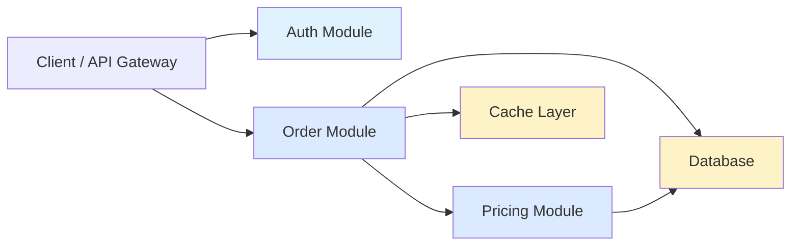
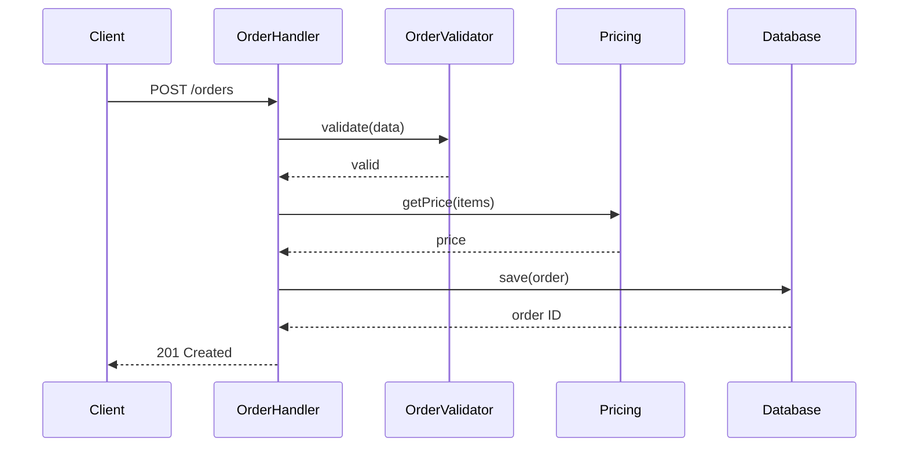
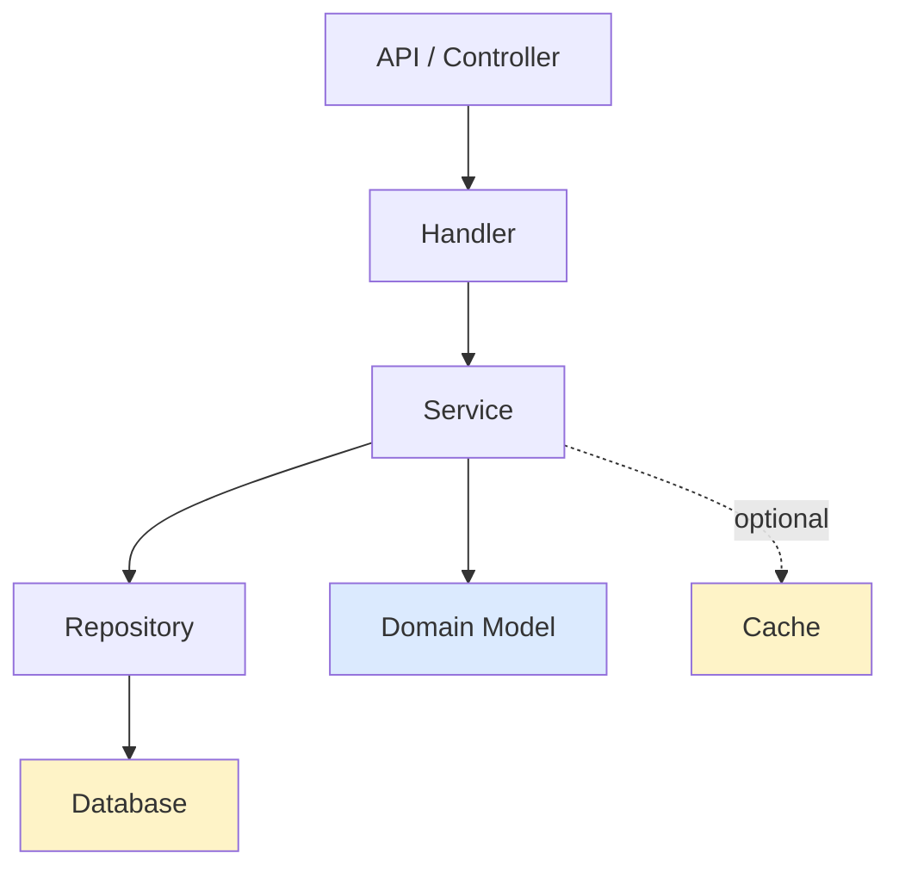

# Codebase Architecture Overview

Generate a comprehensive architectural overview of an existing codebase, including textual descriptions, Mermaid diagrams, module relationships, and data flows. The report is written as a markdown file to the temp directory and the project's `CONTEXT.md` is integrated or created as needed.

## Process

### 1. Explore the Codebase

Use an explore agent to walk the codebase systematically:

- **Directory structure** — understand the top-level organization and naming conventions
- **Entry points** — identify main applications, CLI entrypoints, test frameworks
- **Key modules** — find significant packages, services, or domain-driven components
- **File patterns** — note naming conventions (`*Handler.ts`, `*Service.ts`, `*Model.ts`, etc.)
- **Dependencies** — identify external packages and their purposes (frameworks, databases, utilities)
- **Data flow** — trace how data moves through the system (request → processing → response)
- **Seams and boundaries** — look for interfaces, adapters, and architectural boundaries
- **Language and frameworks** — determine tech stack and coding style

Explore organically, but prioritize understanding:
- What does this system do at a high level?
- What are its major subsystems or domains?
- How do those subsystems communicate?
- What are the entry and exit points?

### 2. Check for Existing CONTEXT.md

Before writing, check if the repository has a `CONTEXT.md` at the root (or at the context root if using `CONTEXT-MAP.md`). If it exists, read it and respect the existing terminology and domain vocabulary.

If no `CONTEXT.md` exists, you will create one as part of the report process.

**File structure patterns:**

```
/ (single context)
├── CONTEXT.md
├── docs/adr/
└── src/

/ (multiple contexts)
├── CONTEXT-MAP.md
├── src/
│   ├── ordering/
│   │   └── CONTEXT.md
│   └── billing/
│       └── CONTEXT.md
```

### 3. Generate Architectural Overview Report

Write a markdown file to the OS temp directory: `<tmpdir>/architecture-overview-<ISO-timestamp>.md`

The report should include:

#### 3a. Executive Summary

Brief overview (2-3 sentences):
- What does this system do?
- What are its primary responsibilities?
- Key architectural decisions or constraints?

#### 3b. System Diagram

A top-level **system diagram** showing major modules/subsystems and their relationships using Mermaid. Use a flowchart or graph to show:
- Primary domains or subsystems
- Data flow direction (request → processing → response)
- External integrations (databases, APIs, message queues)
- Color coding for layers (presentation, business logic, data access)

Example:


#### 3c. Module Hierarchy

Structured breakdown of modules with:
- **Module name** — using domain vocabulary from CONTEXT.md (or discovered vocabulary)
- **Purpose** — one sentence on what it does
- **Key files** — main implementation files (relative to repo root)
- **Responsibilities** — bullet list of what the module owns
- **Dependencies** — what other modules/packages it depends on
- **Interfaces** — key exports or public methods

Format as nested sections with code blocks for key files:

```markdown
### Order Module

**Purpose:** Manages the complete order lifecycle from intake through fulfillment.

**Key files:**
- `src/modules/order/handler.ts`
- `src/modules/order/model.ts`
- `src/modules/order/repository.ts`

**Responsibilities:**
- Order validation and creation
- Order state transitions
- Order persistence

**Dependencies:**
- Pricing Module (pricing lookups)
- Database (PostgreSQL via Prisma)

**Key interfaces:**
- `OrderHandler.create(data)` — creates a new order
- `OrderHandler.transition(id, newState)` — moves order to new state
- `OrderRepository.findById(id)` — retrieves order by ID
```

#### 3d. Data Flow Diagrams

For each major flow (e.g., "Creating an Order", "Processing Payment"), create a sequence diagram:



#### 3e. Dependency Graph

Show inter-module dependencies to visualize coupling:



#### 3f. Terminology and Glossary

Extract or create domain vocabulary from the codebase. This becomes the foundation for CONTEXT.md. Examples:

- **Order** — a customer's request for goods or services
- **Fulfillment** — process of preparing and shipping an order
- **Inventory** — available stock
- **SKU** — Stock Keeping Unit; a unique identifier for a product variant

Use consistent terminology throughout the report. If the codebase uses terms inconsistently, note it as a potential refactoring opportunity.

#### 3g. Technology Stack

Table or bullet list of:
- Runtime/Language (Node.js 20, Python 3.11, etc.)
- Frameworks (Express, Next.js, Django, etc.)
- Databases (PostgreSQL, MongoDB, etc.)
- Key dependencies (ORM, validation, testing, etc.)
- External services (payment processors, message queues, etc.)

#### 3h. Architectural Patterns

Identify and describe patterns in use:
- Layered architecture (controller → service → repository)
- Domain-driven design (clear domain modules)
- Event-driven architecture (event emitters/subscribers)
- CQRS (command/query separation)
- Adapter pattern (interface → implementation)
- Other notable patterns

### 4. Populate or Update CONTEXT.md

After analysis, the CONTEXT.md file should be created or updated with:

- **Overview** — system purpose and primary responsibilities
- **Core domains** — main business concepts and their relationships
- **Glossary** — domain vocabulary with definitions (use exactly as discovered from the codebase)
- **Architecture** — high-level architectural decisions and constraints
- **Integration points** — external systems and APIs

**Format example:**

```markdown
# CONTEXT.md

## Overview

This is the Order Management System. It manages the complete order lifecycle from customer intake through fulfillment and delivery.

## Core Domains

- **Order** — a customer's request for goods or services. Orders move through states: pending → confirmed → fulfilled → delivered.
- **Inventory** — available stock across warehouses
- **Fulfillment** — process of picking, packing, and shipping orders

## Glossary

- **SKU** (Stock Keeping Unit) — unique identifier for a product variant
- **Fulfillment** — process of preparing and shipping an order
- **Backorder** — order for items not currently in stock
- **Allocation** — process of assigning inventory to orders

## Architecture

Layered architecture with clear separation:
- **API Layer** — HTTP endpoints (Express)
- **Domain Layer** — business logic and state machines
- **Persistence Layer** — database access via Prisma ORM

## Integration Points

- **Payment Provider** — Stripe API for payment processing
- **Inventory System** — real-time stock level sync via HTTP
- **Shipping Provider** — FedEx/UPS APIs for label generation
```

**Integration approach** (following `grill-with-docs` pattern):

- If CONTEXT.md already exists, **do not overwrite** — compare your findings against it and note where terminology differs
- Create CONTEXT.md lazily if it doesn't exist, once you've gathered enough domain vocabulary
- Use consistent terminology from the codebase; do not invent new names
- Link discovered vocabulary to actual code locations (files, classes, functions) so the glossary is grounded

### 5. Output and Next Steps

1. **Write the markdown report** to `<tmpdir>/architecture-overview-<ISO-timestamp>.md`
2. **Print the absolute path** of the report to stdout
3. **If CONTEXT.md was created or updated**, print that path as well
4. **Ask the user**: "Would you like me to explore any specific module in more detail, or shall we discuss architectural improvements?"

## Report Details

See [REPORT-FORMAT.md](REPORT-FORMAT.md) for detailed formatting, diagram patterns, and styling guidance.

See [EXAMPLE-REPORT.md](EXAMPLE-REPORT.md) for a complete example of an architecture overview report.

## Advanced Features

### Variants by Project Type

The overview adapts to the codebase:

- **Monorepo** — identify workspace layout, cross-package dependencies, and build graph
- **Microservices** — show service boundaries, inter-service communication, and deployment units
- **Web application** — emphasize client/server separation, API contracts, and state management
- **Library** — focus on public exports, extension points, and internal organization

### Architectural Health Checks

While exploring, note potential friction:

- Circular dependencies between modules
- Modules that are too shallow (interface nearly matches implementation)
- Inconsistent naming or structure (e.g., some handlers, some services)
- Untestable code due to poor seams
- External coupling (test infrastructure depends on production system)

Surface these in a separate "Observations" section if significant, but don't propose refactors here — that's the job of `improve-codebase-architecture`.

