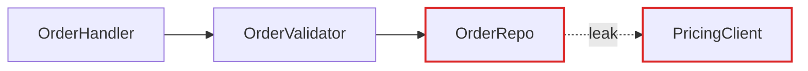
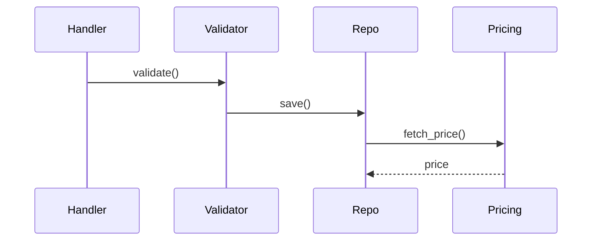
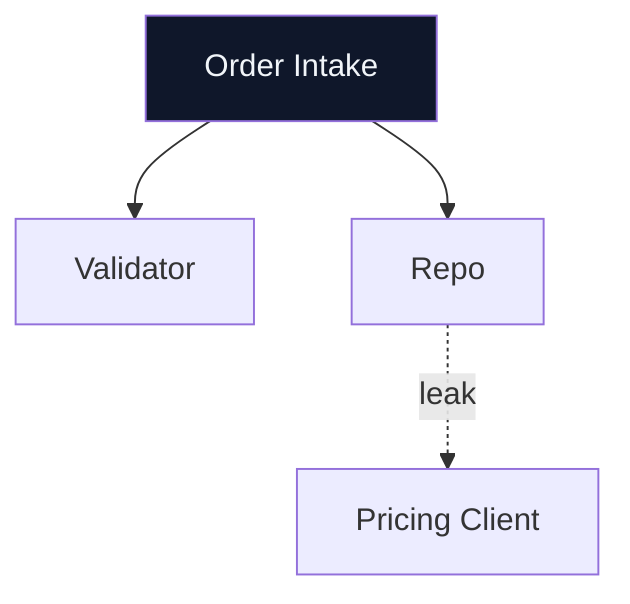

# Markdown Report Format

The architectural review is rendered as a markdown file in the OS temp directory. The report uses standard markdown with fenced code blocks for diagrams, making it portable and easy to share.

## Structure

```markdown
# Architecture Review — {{repo name}}

**Date:** {{date}}  
**Report location:** {{path}}

---

## Executive Summary

Brief overview of findings and number of candidates.

---

## Candidates

### {{Candidate Title}}

**Files:**
- `src/modules/order/intake.ts`
- `src/modules/order/validator.ts`

**Recommendation strength:** Strong | Worth exploring | Speculative

**Problem:**
Single sentence describing the friction point.

**Solution:**
Single sentence describing what would change.

**Benefits:**
- Locality: bugs concentrate in one module
- Leverage: one interface, N call sites
- Interface shrinks; implementation absorbs wrappers
- Tests hit one interface, not six function calls

**Before / After:**

**Before:**
\`\`\`mermaid
flowchart LR
    A[OrderHandler] --> B[OrderValidator]
    B --> C[OrderRepo]
    C -.leak.-> D[PricingClient]
    classDef leak stroke:#dc2626,stroke-width:2px;
    class C,D leak
\`\`\`

**After:**
\`\`\`mermaid
flowchart LR
    A[OrderHandler] --> B[OrderIntake]
    B --> C[OrderRepo]
    classDef deep fill:#0f172a,stroke:#1e293b,color:#f1f5f9;
    class B deep
\`\`\`

**ADR Note:** ⚠️ Contradicts ADR-0007 — but worth reopening because the current design is causing real friction in testing.

---

## Top Recommendation

**Collapse the Order intake pipeline** — Start here. This candidate has the highest leverage: it unblocks N downstream test suites and concentrates the validation logic where bugs belong. See [Collapse the Order intake pipeline](#collapse-the-order-intake-pipeline) above.
```

## Diagram Patterns

### Mermaid Graphs (Recommended for dependencies and call flow)

Use `mermaid` fenced code blocks for graph-shaped relationships:

**Flowchart for call flow:**


**Sequence diagram for round-trip reduction:**


**Directed graph for dependency structure:**


### ASCII Art for Editorial Visuals

Use ASCII art for mass diagrams, cross-sections, or when Mermaid layout doesn't match your intent:

**Before: Interface as wide as implementation (shallow)**
```
┌─────────────────────────┐
│   Interface Surface     │  
│ (6 methods, 12 params)  │
└─────────────────────────┘
┌─────────────────────────┐
│   Implementation        │  
│ (50 lines, core logic)  │
└─────────────────────────┘
```

**After: Deep module (small interface, large implementation)**
```
┌────────────────────┐
│ Interface Surface  │  
│ (1 method, 2 params)
└────────────────────┘
┌────────────────────┐
│   Implementation   │  
│ (120 lines, logic) │
│ concentrated here  │
└────────────────────┘
```

**Layered shallowness (before)**
```
┌─────────────────────────────────┐
│ Handler (1 line: delegate)      │
├─────────────────────────────────┤
│ Validator (1 line: delegate)    │
├─────────────────────────────────┤
│ Repo (1 line: delegate)         │
├─────────────────────────────────┤
│ Pricing Client (real work, 50 L)│
└─────────────────────────────────┘
```

**Collapsed (after)**
```
┌─────────────────────────────────┐
│ Order Intake (all logic here)    │
│ - validate                       │
│ - transform                      │
│ - apply pricing                  │
│ (80 lines, one place)            │
└─────────────────────────────────┘
```

## File Paths

Paths should be monospaced. Keep paths relative to repo root:

```
- `src/modules/order/intake.ts`
- `src/modules/order/handler.ts`
- `src/modules/pricing/client.ts`
```

## Tone & Language

Use exactly: **module, interface, implementation, depth, deep, shallow, seam, adapter, leverage, locality.**

Never substitute: component, service, unit (for module) · API, signature (for interface) · boundary (for seam) · layer, wrapper (for module).

**Example phrasings:**

- "Order intake module is shallow — interface nearly matches the implementation."
- "Pricing leaks across the seam."
- "Deepen: one interface, one place to test."
- "Two adapters justify the seam: HTTP in prod, in-memory in tests."

**Benefits bullets** name the gain in glossary terms:
- ✓ "Locality: bugs concentrate in one module"
- ✓ "Leverage: one interface, N call sites"
- ✓ "Interface shrinks; implementation absorbs the wrappers"
- ✗ "Easier to maintain" (vague, not in glossary)
- ✗ "Cleaner code" (subjective, not in glossary)

## Recommendation Strength

Render as plain text:

- **Strong** — High leverage, clear win, low risk. Tackle first.
- **Worth exploring** — Good friction signal, needs more design work.
- **Speculative** — Interesting observation, but friction is borderline or risk is high.

## ADR Callouts

Use this format when a candidate contradicts an ADR:

```
⚠️ Contradicts ADR-0007 — but worth reopening because the current design is causing real friction in testing.
```

Only include if friction is real and substantial. Skip ephemeral reasons ("not worth it right now") and self-evident ones.

## Style

- **Headings** — use `#`, `##`, `###` to structure candidates and sections.
- **Code blocks** — fenced with triple backticks; use `mermaid` for diagrams, nothing for ASCII art.
- **Lists** — bullets (`-`) for benefits; avoid long paragraphs.
- **Spacing** — blank lines between sections for readability.
- **Emphasis** — use *italic* for terms from [LANGUAGE.md](LANGUAGE.md); **bold** for key concepts.

## Report Filename

- Pattern: `architecture-review-<ISO-timestamp>.md`
- Example: `architecture-review-2026-05-28T053046Z.md`
- Location: OS temp directory (`$TMPDIR`, `/tmp`, or `%TEMP%`)

## After Writing

1. Print the absolute path to stdout.
2. Ask the user: "Which of these would you like to explore?"
3. Wait for their selection before moving to the grilling phase.
